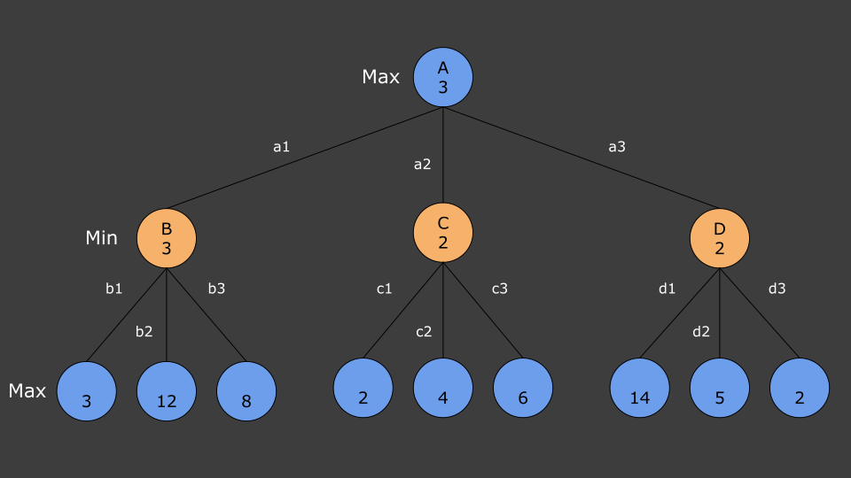

### [Kursinhalt](../README.md)

MinMax-Algorithmus
===================

In diesem Kapitel möchte ich dir den MinMax-Algorithmus erklären, der hervorragend dazu geeignet ist KIs für Spiele wie TicTacToe, Vier gewinnt, oder auch Schach zu programmieren. 

Zunächst einmal benötigen wir das Konzept des Spielbaums. Im Folgenden Schaubild ist ein fiktives Spiel abstrakt dargestellt. Ausgehend von der Spielstellung **A** gibt es für den Spieler am Zug drei mögliche Spielzüge: **a1**, **a2** und **a3**. Diese führen zu den Spielstellungen **B**, **C** und **D**. Nun ist der andere Spieler am Zug. Dieser hat wiederum für jede Spielstellung drei mögliche Züge. Auf diese weise entsteht eine baumartige Struktur.

Quelle: Frei nach *Artificial Intelligence - A Modern Approach* von Russel und Norvig, Abbildung 5.2.

Dieser Baum wird relative schnell sehr groß, für TicTacToe zum Beispiel hat der Startspieler zu Beginn 9 mögliche Züge, der zweite Spieler dann nur noch 8, u.s.w. Für den TicTacToe-Spielbaum erhalten wir somit circa Fakultät(9)=362.880 mögliche Spielstellungen. In Wirklichkeit sind es etwas weniger, da manche Spiele ja bereits enden bevor das Spielfeld randvoll mit Kreuzen und Zeichen ist. 

Die Idee ist nun dass eine KI genau diesen Spielbaum generiert. Allerdings dauert es für die meisten Spiele zu lange den gesamten Baum zu erstellen. Deshalb wird dieser von einer KI nur bis zu einer bestimmten Tiefe berechnet. Im Falle unseres Schaubilds nur bis zur Tiefe 2, jeder Spieler macht einen Zug. Danach wird der Baum gewissermaßen abgeschnitten.

Mittels dieses Baumes kann die KI nun den besten Zug wählen. Nur, was ist der beste Zug? Hierzu bewerten wir jede Spielstellung, also geben an wie gut die Spielstellung für Spieler 1 und Spieler 2 ist. Und hier kommt der Clou: Für die Bewertung der Spielstellung reicht eine einzige Zahl. Dies ist der Fall da die Erfolgsaussichten für die Spieler symmetrisch verteilt sind, man spricht deshalb auch von einem **Nullsummenspiel**. Ist beispielsweise die Stellung ausgeglichen, so gilt dies für beide Spieler. Ist die Stellung gut für Spieler 1, so ist sie schlecht für Spieler 2. Ist sie exzellent für Spieler 1, so ist sie miserabel für Spieler 2, u.s.w. 

Der Max-Spieler versucht eine Stellung mit einer möglichst hohen Zahl zu erreichen, der Min-Spieler eine Stellung mit einer möglichst niedrigen Zahl. In unserem Schaubild wäre der beste Ausgang für den Max-Spieler die Stellung mit der Bewertung 14, die durch die Züge **a3** und **d1** entstehen würde. Ist es also ratsam für den Max-Spieler den Zug **a3** zu wählen? Dies ist leider nicht der Fall, da der Min-Spieler auch noch ein Wörtchen mitzureden hat. Der Min-Spieler würde dann nämlich den Zug **d3** wählen und die resultierende Spielstellung hätte die Bewertung 2, was einen schlechten Ausgang für den Max-Spieler darstellt.

Die besten Züge für die beiden Spieler sind **a1** und **b1**. Eine Spielstellung mit Bewertung 3 ist also das beste was der Max-Spieler derzeit erreichen kann.

Der MinMax-Algorithmus wählt also immer den besten Zug aus. Dies geschieht unter Berücksichtigung, dass der Gegner auch den besten Zug auswählen wird. Der Algorithmus versucht also nicht möglichst schnell zu gewinnen und auf Fehler des Gegners zu hoffen. Stattdessen geht die KI davon aus dass auch der Gegner den besten Zug macht. Macht der Gegner nicht den besten Zug, so ist die resultierende Spielstellung sowieso besser als diejenige die durch die jeweils besten Züge erreicht wird.

Es bleibt nun nur noch zu klären wie die Bewertungen der Spielstellungen zustande kommen. Hierin steckt nämlich die eigentliche Intelligenz der KI. In einer Spielstellung in der das Spiel beendet ist, ist dies noch einfach. Wir können die Spielstellung mit plus unendlich bewerten falls Max gewonnen hat, mit minus unendlich falls Min gewonnen hat, und mit 0 für unentschieden. 

Für Spielstellungen die offen sind brauchen wir dagegen eine sogenannte **Heuristik**. Diese ist für jedes Spiel verschieden, und wie bereits erwähnt, steckt in dieser die eigentliche Intelligenz unserer MinMax-KI. 

Denken wir einmal an eine Vier gewinnt-Stellung. Wie gut ist diese für die jeweiligen Spieler?, wie können wir eine Bewertung berechnen? Mit Sicherheit sind verbundenen Steine besser als einzelne Steine. Eine Viererverbindung würde das Spiel ja auch direkt gewinnen. Aber auch Dreier- und Zweierverbindungen sind wichtig, da diese ja zu einer Viererverbindung führen können. Aber auch einzelne Steine stellen einen Weg zum Ziel dar.

Eine einfache Heuristik für Vier gewinnt könnte also wie folgt die Bewertung einer Spielstellung berechnen:

Bilde die Summe aus der Anzahl Steine des Max-Spielers, sowie seiner Anzahl an Zweier- und Dreierverbindungen. (Die Viererverbindungen brauchen wir an dieser Stelle nicht mehr mit einzubeziehen, dann wäre das Spiel ja sowieso beendet.) Bilde anschließend die gleiche Summe für den Min-Spieler. Die Bewertung ergibt sich dann aus der Differenz der beiden Summen. 

Beim Schach würde eine Heuristik natürlich ganz anders funktionieren. Hier sind die folgenden Fragen wichtig: Welche Figuren besitzen die Spieler noch? Welchen Bewegungsfreiraum haben die Figuren? 

Wie du siehst eröffnet sich für jedes Spiel eine neue Welt, obwohl der zugrundeliegende Algorithmus immer der Selbe ist. 

### [Kursinhalt](../README.md)
---