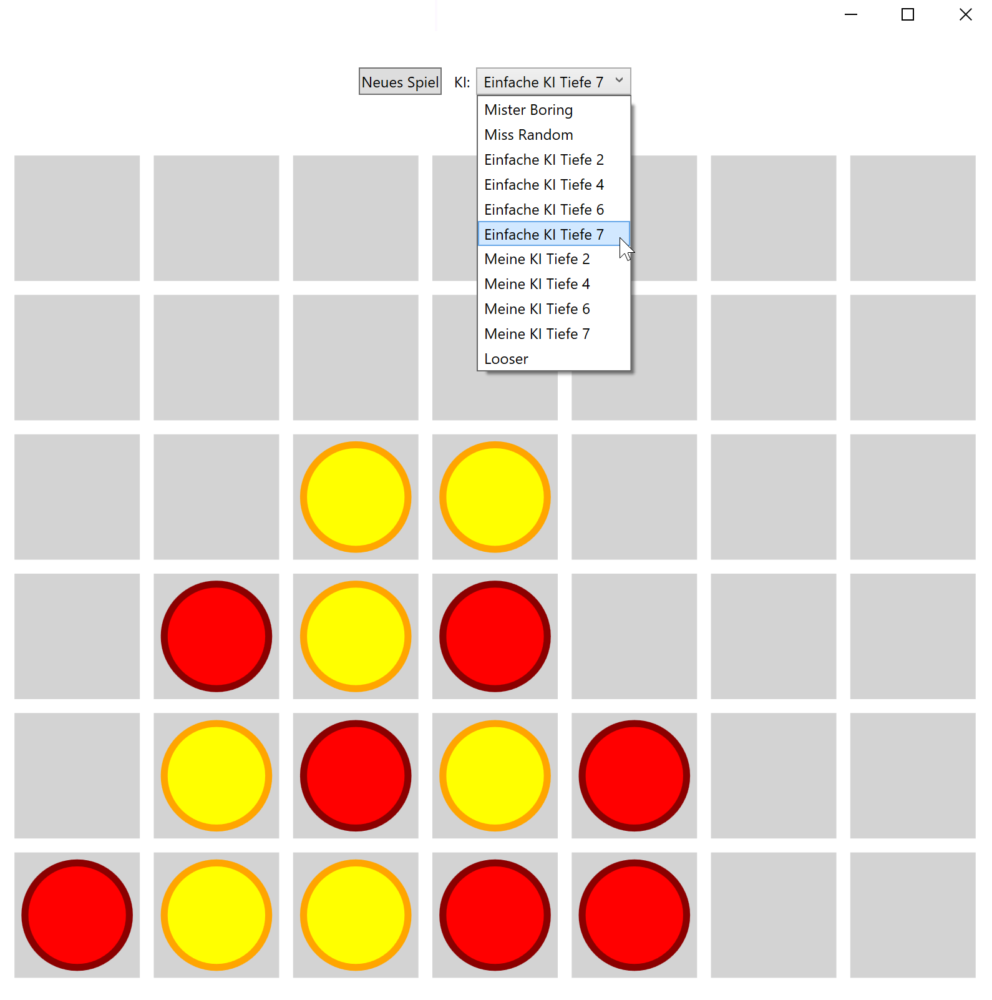

# Lerne Programmieren mit C# und künstlicher Intelligenz

Das Skript zum Programmierkurs.

- Autor: Kevin Schaal
- Kontakt: m31coding@gmail.com

## Kursinhalt

- [Kursübersicht](Kapitel/Kursübersicht.md)

---

- [C# und Hallo Welt](Kapitel/CSharpUndHalloWelt.md)
- [Variablen](Kapitel/Variablen.md)
- [**Übungen**: Variablen](Übungen/Variablen.md)
- [Datentypen](Kapitel/Datentypen.md)
- [**Quiz**: Datentypen](https://forms.gle/kof5nc34mzCXnVR76)
- [Zahlenoperatoren](Kapitel/Zahlenoperatoren.md)
- [**Übungen**: Zahlentypen und Operatoren](Übungen/ZahlentypenUndOperatoren.md)
- [Methoden](Kapitel/Methoden.md)
- [**Übungen**: Methoden](Übungen/Methoden.md)
- [Verzweigungen](Kapitel/Verzweigungen.md)
- [Operatoren der Wahrheitswerte](Kapitel/OperatorenDerWahrheitswerte.md)
- [**Quiz**: Wahrheitswerte](https://forms.gle/eVSgLtWgCNyw5NsJ7)
- [**Übungen**: Verzweigungen und Wahrheitswerte](Übungen/VerzweigungenUndWahrheitswerte.md)
- [Schleifen](Kapitel/Schleifen.md)
- [Benutzereingaben](Kapitel/Benutzereingaben.md)
- [**Übungen**: Schleifen und Benutzereingaben](Übungen/SchleifenUndBenutzereingaben.md)
- [**Abschlussübungen**: Zahlenzauber](Übungen/Zahlenzauber.md)

---

- [Listen und Arrays](Kapitel/ListenUndArrays.md)
- [**Quiz**: Listen und Arrays](https://forms.gle/fA6qGSgwzzb97wBUA)
- [IEnumerable Schnittstelle und LINQ](Kapitel/IEnumerableUndLINQ.md)
- [Enums](Kapitel/Enums.md)
- [Klassen](Kapitel/Klassen.md)
- [Schnittstellen](Kapitel/Schnittstellen.md)
- [Strukturen](Kapitel/Strukturen.md)
- [**Übungen**: TicTacToe KIs](Übungen/TicTacToeKIs.md)
- [**Video**: Verzweigungen mit switch](Kapitel/Switch.md)
- [**Übungen**: switch](Übungen/Switch.md)
- [Der MinMax-Algorithmus](Kapitel/MinMax.md)
- [**Abschlussübung**: Vier gewinnt KI](Übungen/VierGewinntKI.md)

## Ressourcen

- [Glossar](https://docs.google.com/spreadsheets/d/1w_FkXoN7iZ44eHloq2H4qOmTBGMPEinPypG_ez_MZ24/edit?usp=sharing)

- [Visual Studio Tastenkombinationen](https://docs.google.com/spreadsheets/d/1C9p5r9nrLpd9N_28RipjmsC5OU0Jn42Eyw7QIL4YNaw/edit?usp=sharing)

